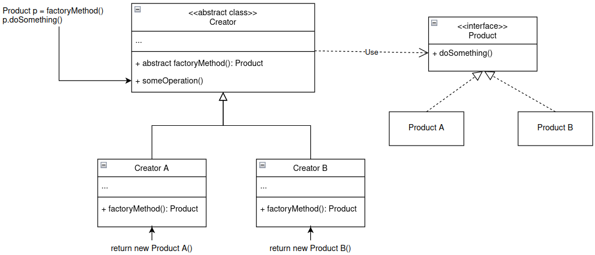

# I. Factory Method
- **When**: Dùng cho các class cùng loại (cùng implement từ 1 interface), số lượng devired class lớn.
- **Heart**: Tạo một abstract có 1 abstract function tập trung cho việc khởi tạo instance và các operation khác. ClientCode chỉ cần tương tác với abstract class này.
- **Why**: scale cực tốt -> chỉ cần thêm 2 class con: derived class (implement từ interface) và creator class (inheritance abstract Creator class).
- **Class Diagram**:

